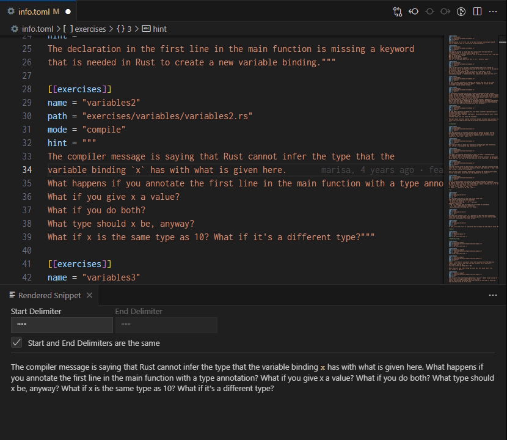

# Markdown Snippets Renderer

If you're working on files with a lot of markdown snippets, you might want to see how they look, without having to constantly having to do manual steps. This extension will render your current snippet (where your cursor is), based on the delimiters you have configured.

## Features

- Renders markdown snippets in a preview window
- Custom delimiters, for both start and end
- Syntax highlighting for code blocks (if a language is specified)
- Configurable Markdown options:
    - Render HTML
    - Treat newlines as paragraph breaks
    - Automatically "linkify" URLs
    - Markdown-It's Typographer
    - Custom quotes for Typographer
    - Syntax highlighting theme

## Requirements

None.

## Release Notes

Users appreciate release notes as you update your extension.

### 0.1.0

Initial release.

